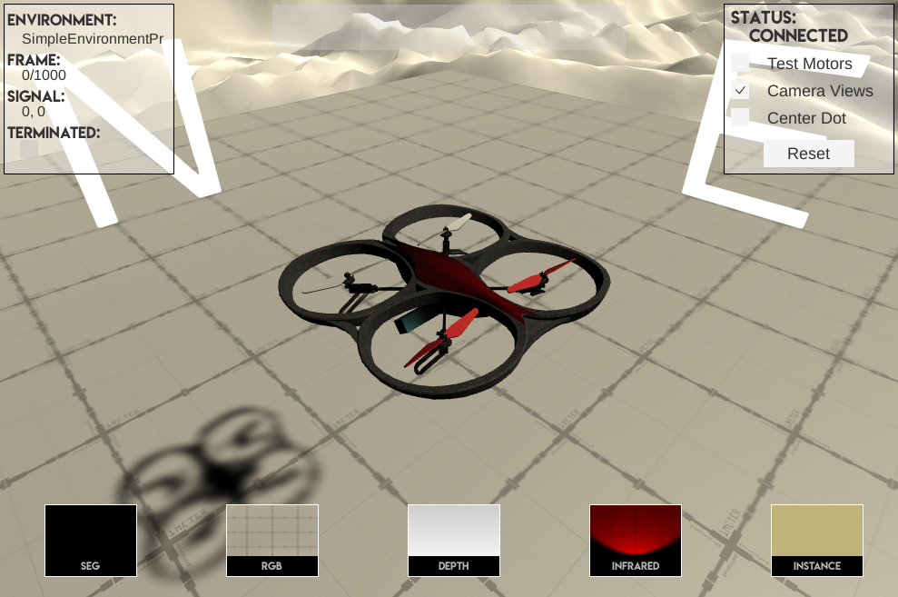

# AAV

---

_[Neodroid](https://github.com/sintefneodroid) is developed with support from Research Council of Norway Grant #262900. ([https://www.forskningsradet.no/prosjektbanken/#/project/NFR/262900](https://www.forskningsradet.no/prosjektbanken/#/project/NFR/262900))_

---




[](http://www.youtube.com/watch?v=zKcMzuH4Zy4)

<a href="http://www.youtube.com/watch?feature=player_embedded&v=zKcMzuH4Zy4" target="_blank"></a>

Note: Temporary file hosting repo, may be taken down and replaced at any moment.

Run after cloning:
```git submodule init && git submodule update && cd Assets/droid && git-lfs pull```
